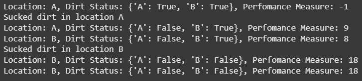

# ExpNo 1 : Developing AI Agent with PEAS Description

---

## AIM
To find the PEAS description for the given AI problem and develop an AI agent.  

---

## Theory

### Medicine Prescribing Agent
This agent prescribes medicine for fever (greater than 98.5°F), which we consider as unhealthy. The user provides the temperature input.  
The environment is a hospital with two rooms. The agent has to consider two factors:  

1. **Room location**  
2. **An unhealthy patient in a random room**  

The agent moves between rooms to check and treat unhealthy patients.  

- The **performance** of the agent is calculated by **incrementing** when treating and **decrementing** when moving.  
- After treating in one room, it must move to another room to check again.  
- Hence, the agent prescribes medicine to unhealthy patients efficiently.  

---

## PEAS Description

| Agent Type                  | Performance                        | Environment       | Actuators              | Sensors                      |
|-----------------------------|------------------------------------|------------------|------------------------|------------------------------|
| Medicine prescribing agent  | Treating unhealthy, agent movement | Rooms, Patients  | Medicine, Treatment    | Location, Patient Temperature |

---

## Design Steps

### Step 1: Identifying the Input
- Temperature from patients  
- Location  

### Step 2: Identifying the Output
- Prescribe medicine if the patient in a random room has a fever  

### Step 3: Developing the PEAS Description
- PEAS description is developed by the performance, environment, actuators, and sensors in an agent.  

### Step 4: Implementing the AI Agent
- Treat unhealthy patients in each room.  
- Check for unhealthy patients in a random room.  

### Step 5: Measuring the Performance
- For each treatment → **Performance incremented**  
- For each movement → **Performance decremented**  

## Program

### Name: Vishwaraj G
### Register Number: 212223220125

```
import random

class VacuumCleanerAgent:
    def __init__(self):  # Initialize the agent's state (location and dirt status)
        self.location = "A"  # Initial location (can be "A" or "B")
        self.dirt_status = {
            "A": True,
            "B": True,
        }  # Initial dirt status (False means no dirt)
        self.performance = 0

    def move_left(self):  # Move the agent to the left if possible
        if self.location == "B":
            self.location = "A"

    def move_right(self):  # Move the agent to the right if possible
        if self.location == "A":
            self.location = "B"

    def suck_dirt(self):  # Suck dirt in the current location if there is dirt
        if self.dirt_status[self.location]:
            self.dirt_status[self.location] = False
            print(f"Sucked dirt in location {self.location}")

    def do_nothing(self):  # Do nothing
        pass

    def perform_action(self, action):  # Perform the specified action
        if action == "left":
            self.performance = self.performance - 1
            self.move_left()
        elif action == "right":
            self.performance = self.performance - 1
            self.move_right()
        elif action == "suck":
            self.performance = self.performance + 10
            self.suck_dirt()
        elif action == "nothing":
            self.do_nothing()
        else:
            print("Invalid action")

    def print_status(self):  # Print the current status of the agent
        print(f"Location: {self.location}, Dirt Status: {self.dirt_status}, ", end="")
        print(f"Perfomance Measure: {self.performance}")


# Example usage:
agent = VacuumCleanerAgent()
# Move the agent, suck dirt, and do nothing
agent.perform_action("left")
agent.print_status()
agent.perform_action("suck")
agent.print_status()
agent.perform_action("right")
agent.print_status()
agent.perform_action("suck")
agent.print_status()
agent.perform_action("nothing")
agent.print_status()
```
## Output:

## Result:
Thus the Developing AI Agent with PEAS Description was implemented using python programming.